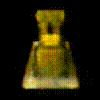

# Neural Radiance Field (NeRF)

To implement the Neural Radiance Field (NeRF) to synthesize novel views of complex scenes by optimizing an underlying continuous volumetric scene function using a sparse set of input views. NeRF takes input as a single continuous 5D coordinate spatial location (x, y, z) and viewing direction (θ, ϕ) and provides the output as the volume density and emitted radiance which depends on the view. 


## Dataset
Download the lego data for NeRF from the original author’s link [here](https://drive.google.com/drive/folders/1lrDkQanWtTznf48FCaW5lX9ToRdNDF1a)

## Implementation

### To train the NeRF model:
```
python3 Train.py
```
Path where the checkpoints are being saved: "./Checkpoint/"

### To test the NeRF model:
```
python3 Test.py
```

### Result:


## References:
1. https://rbe549.github.io/spring2023/proj/p2/
2. https://arxiv.org/abs/2003.08934
3. https://pyimagesearch.com/2021/11/17/computer-graphics-and-deep-learning-with-nerf-using-tensorflow-and-keras-part-2/
4. https://colab.research.google.com/github/keras-team/keras-io/blob/master/examples/vision/ipynb/nerf.ipynb
